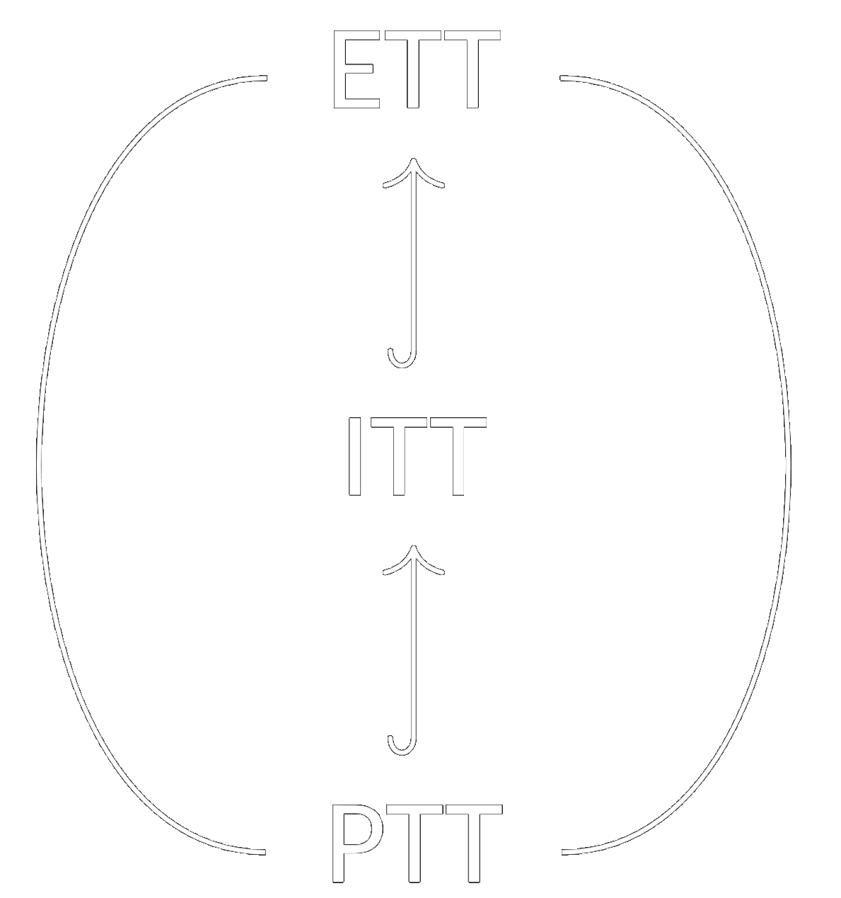

# About

I am a PhD candidate at the [University of Amsterdam](https://www.uva.nl/), part of the [Institute for Logic, Language, and Computation](https://www.illc.uva.nl/), and member of the [Mathematical and Computational Logic Unit](https://www.illc.uva.nl/Research/Organisation/Research-Units/MCL/).
My supervisors are [Benno van den Berg](https://staff.fnwi.uva.nl/b.vandenberg3/) and [Herman Geuvers](http://www.cs.ru.nl/~herman/).

My main interest is type theory, which I study using tools from category theory.
A central objective is proving conservativity results: showing that minimalistic versions of type theory can already derive the same statements as more complex versions.
These results allows for flexibility: simple versions are easier to model and study, while more extensive versions are convenient to work in and therefore implemented by proof assistents.
An example of such a result is our paper: [Conservativity of Type Theory over Higher-order Arithmetic](https://arxiv.org/abs/2308.15288).

# Current Project: Equality in Type Theory

The main notion of equality in type theory is propositional equality: this is an internal notion, so we can reason about this equality within the system.
However, as is generally the case in mathematics, this equality is not decidable.
For that reason, we also consider a stricter notion in the form of definitional equality: this is an external notion based on reductions, and therefore generally decidable.
This equality is used for computation, which allows type checking to be decidable.

Which equalities are definitional depends on the version of type theory: extensional type theory (ETT) only has definitional equalities, intensional type theory (ITT) has some definitional equalities, while propositional type theory (PTT) has no definitional equalities.
This has little infuence on provability: [Winterhalter and Boulier](https://github.com/TheoWinterhalter/ett-to-wtt), building on work of [Hofmann](https://link.springer.com/chapter/10.1007/3-540-61780-9_68) and [Oury](https://link.springer.com/chapter/10.1007/11541868_18), proved that ETT is conservative over PTT plus two additional rules: binder extensionality and uniqueness of identity proofs (uip).
However, the amount of definitional equality has a large influence on decidability: type checking is undecidable for ETT, decidable for ITT with nonelementary complexity, and decidable for PTT in linear time ([as we recently showed](assets/slides/type_checking_for_propositional_type_theory_in_linear_time_slides.pdf)).

# Contact Info

 \\
Office F2.11 \
Science Park 107 \
1098 XG Amsterdam \
The Netherlands
